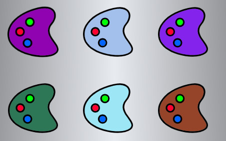
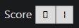
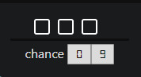
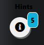

# webcolorgame
A HTML 5 game!

    <ul>
        <li>You have 6 color plate. 
        
  
 </li>
        <li>A RGB value has shown to you.
        
  

        You have to choose which one is the right color in a limited time period</li>
        <li>If you choose the right color, you will get a score. 
        
  

        however, if you choose the wrong color, your chances reduce
        
  

        </li>
        <li> If you stack in a similiar color, use hints button, in every level you will get limited hints
        
  

        If you choose right color 3 times in a row, Your chances will increase
        
  

        </li>
        <li>If all chances are gone then, game over.  Test your knowledge and score 50 to complete 5 levels</li>
     </ul>
